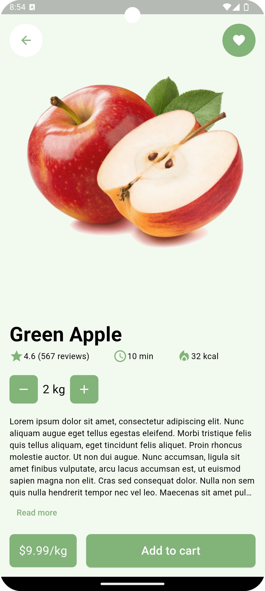

# Grocery Store Home
A Flutter home screen for a grocery shopping app with a user-friendly and intuitive design.

## 🌟 Features
- Carousel slider for product categories with images
- Grid view displaying popular grocery items
- Side drawer menu with custom icons and white background
- Animated bottom navigation bar with custom icons and white background
- Search bar for finding specific items quickly
- User profile section with account details and settings

## 📸 Screenshots
<p>


</p>

## 🛠️ Technologies Used
- **Frontend**: Flutter, Dart
- **State Management**: StatefulWidget
- **Plugins**: material_symbols_icons, stylish_bottom_bar, animated_icon_button, convex_bottom_bar, google_fonts, modal_bottom_sheet

## 📝 Setup Instructions
Follow these steps to set up the project locally:

### 1. Clone the Repository
```bash
git clone https://github.com/obadaKraishan/Grocery_App_Home.git
cd Grocery_App_Home
```

### 2. Install Dependencies
```bash
flutter pub get
```

### 3. Run the Application
```bash
flutter run
```

## 📄 Project Structure
```plaintext
lib/
├── main.dart
├── models/
│   ├── grocery_item.dart
├── screens/
│   ├── home_screen.dart
│   ├── product_details_screen.dart
├── widgets/
│   ├── category_slider.dart
│   ├── discount_banner.dart
│   ├── grocery_item.dart
└
```

## 🎨 Customization
### 1. Update Theme
Modify the theme settings in `theme.dart` to customize the app's look and feel.

### 2. Update Categories and Content
Adjust the categories and content in `lib/screens/home_screen.dart` to change the displayed items.

### 3. Add New Features
Create new features and screens in the `lib/screens/` directory and include them in the app's navigation.

## 📄 License
This project is licensed under the MIT License - see the [LICENSE](LICENSE) file for details.

## 👥 Contributors
- [Obada Kraishan](https://github.com/obadaKraishan)
